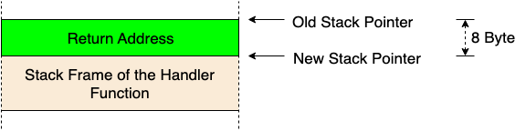
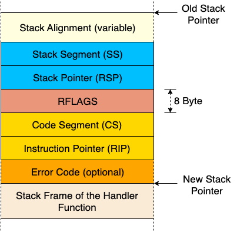

## CPU Exceptions
CPU异常在很多情况下都有可能发生，比如访问无效的内存地址，或者在除法运算里除以0。为了处理这些错误，我们需要设置一个`中断描述符表`来提供异常处理函数。
### introduction
异常信号会在当前指令触发错误时被触发，例如执行了除数为0的除法。当异常发生后，CPU会中断当前的工作，并立即根据异常类型调用对应的错误处理函数。
 
在x86架构中，存在20种不同的CPU异常类型，以下为最重要的几种：
- `Page Fault`: 页错误是被非法内存访问触发的，例如当前指令试图访问未被映射过的页，或者试图写入只读页。
- `Invalid Opcode`: 该错误是说当前指令操作符无效，比如在不支持SSE的旧式CPU上执行了 SSE 指令。
- `General Protection Fault`: 该错误的原因有很多，主要原因就是权限异常，即试图使用用户态代码执行核心指令，或是修改配置寄存器的保留字段。
- `Double Fault`: 当错误发生时，CPU会尝试调用错误处理函数，但如果 在调用错误处理函数过程中 再次发生错误，CPU就会触发该错误。另外，如果没有注册错误处理函数也会触发该错误。
- `Triple Fault`: 如果CPU调用了对应 Double Fault 异常的处理函数依然没有成功，该错误会被抛出。这是一个致命级别的 三重异常，这意味着我们已经无法捕捉它，对于大多数操作系统而言，此时就应该重置数据并重启操作系统。

### 中断描述符
要捕捉CPU异常，我们需要设置一个 中断描述符表 (Interrupt Descriptor Table, IDT)，用来捕获每一个异常。由于硬件层面会不加验证的直接使用，所以我们需要根据预定义格式直接写入数据。符表的每一行都遵循如下的16字节结构。

| 类型   | 名称                         | 描述                                                         |
|--------|------------------------------|--------------------------------------------------------------|
| u16    | Function Pointer [0:15]      | 处理函数地址的低位（最后16位）                               |
| u16    | GDT selector                 | 全局描述符表中的代码段标记。                                 |
| u16    | Options                      | 详情见下表。                                                 |
| u16    | Function Pointer [16:31]     | 处理函数地址的中位（中间16位）。                             |
| u32    | Function Pointer [32:63]     | 处理函数地址的高位（剩下的所有位）。                         |
| u32    | Reserved                     | 保留字段。                                                   |

Options 字段的格式

| Bits | Name                        | Description                                                  |
|------|-----------------------------|--------------------------------------------------------------|
| 0-2  | Interrupt Stack Table Index  | 0: 不要切换栈, 1-7: 当处理函数被调用时，切换到中断栈表的第n层。|
| 3-7  | Reserved                    | 保留位。                                                     |
| 8    | 0: Interrupt Gate, 1: Trap Gate | 如果该比特被置为0，当处理函数被调用时，中断会被禁用。       |
| 9-11 | must be one                 | 必须设置为1。                                                |
| 12   | must be zero                | 必须设置为0。                                                |
| 13-14| Descriptor Privilege Level (DPL) | 执行处理函数所需的最小特权等级。                           |
| 15   | Present                     | 设置为1表示该描述符在内存中存在。                            |

每个异常都具有一个预定义的IDT序号，比如 invalid opcode 异常对应6号，而 page fault 异常对应14号，因此硬件可以直接寻找到对应的IDT条目。
 
通常而言，当异常发生时，CPU会执行如下步骤：
1. 将一些寄存器数据入栈，包括指令指针以及 RFLAGS 寄存器。（我们会在文章稍后些的地方用到这些数据。）
2. 读取中断描述符表（IDT）的对应条目，比如当发生 page fault 异常时，调用14号条目。
3. 判断该条目确实存在，如果不存在，则触发 double fault 异常。
4. 如果该条目属于中断门（interrupt gate，bit 40 被设置为0），则禁用硬件中断。
5. 将 GDT 选择器载入代码段寄存器（CS segment）。
6. 跳转执行处理函数。

### 中断调用约定
异常触发十分类似于函数调用：CPU会直接跳转到处理函数的第一个指令处开始执行，执行结束后，CPU会跳转到返回地址，并继续执行之前的函数调用。
 
然而两者最大的不同点是：函数调用是由编译器通过 call 指令主动发起的，而错误处理函数则可能会由 任何 指令触发。
 
调用约定 指定了函数调用的详细信息，比如可以指定函数的参数存放在哪里（寄存器，或者栈，或者别的什么地方）以及如何返回结果。在 x86_64 Linux 中，以下规则适用于C语言函数（指定于 System V ABI 标准）：
- 前六个整型参数从寄存器传入 rdi, rsi, rdx, rcx, r8, r9
- 其他参数从栈传入
- 函数返回值存放在 rax 和 rdx
注意，Rust并不遵循C ABI，而是遵循自己的一套规则，即 尚未正式发布的 Rust ABI 草案，所以这些规则仅在使用 extern "C" fn 对函数进行定义时才会使用。

### Perserved and Scratch Registers
调用约定将寄存器分为两部分：保留寄存器 和 临时寄存器 。
 
保留寄存器 的值应当在函数调用时保持不变，所以被调用的函数（ “callee” ）只有在保证“返回之前将这些寄存器的值恢复到初始值“的前提下，才被允许覆写这些寄存器的值， 在函数开始时将这类寄存器的值存入栈中，并在返回之前将之恢复到寄存器中是一种十分常见的做法。
 
而 临时寄存器 则相反，被调用函数可以无限制的反复写入寄存器，若调用者希望此类寄存器在函数调用后保持数值不变，则需要自己来处理备份和恢复过程（例如将其数值保存在栈中），因而这类寄存器又被称为 caller-saved。
 
在 x86_64 架构下，C调用约定指定了这些寄存器分类：
| 分类       | 寄存器列表                          |
|------------|-------------------------------------|
| 保留寄存器 (callee-saved) | `rbp`, `rbx`, `rsp`, `r12`, `r13`, `r14`, `r15` |
| 临时寄存器 (caller-saved) | `rax`, `rcx`, `rdx`, `rsi`, `rdi`, `r8`, `r9`, `r10`, `r11` |

编译器已经内置了这些规则，因而可以自动生成保证程序正常执行的指令。例如绝大多数函数的汇编指令都以 push rbp 开头，也就是将 rbp 的值备份到栈中（因为它是 callee-saved 型寄存器）。

### 保存所有寄存器数据
区别于函数调用，异常在执行 任何 指令时都有可能发生。在大多数情况下，我们在编译期不可能知道程序跑起来会发生什么异常。比如编译器无法预知某条指令是否会触发 page fault 或者 stack overflow。
正因我们不知道异常会何时发生，所以我们无法预先保存寄存器。这意味着我们无法使用依赖调用方备份 (caller-saved) 的寄存器的调用传统作为异常处理程序。因此，我们需要一个保存所有寄存器的传统。x86-interrupt 恰巧就是其中之一，它可以保证在函数返回时，寄存器里的值均返回原样。
但请注意，这并不意味着所有寄存器都会在进入函数时备份入栈。编译器仅会备份被函数覆写的寄存器，继而为只使用几个寄存器的短小函数生成高效的代码。

### 中断栈帧
当一个常规函数调用发生时（使用 call 指令），CPU会在跳转目标函数之前，将返回地址入栈。当函数返回时（使用 ret 指令），CPU会在跳回目标函数之前弹出返回地址。所以常规函数调用的栈帧看起来是这样的：

  
    

对于错误和中断处理函数，仅仅压入一个返回地址并不足够，因为中断处理函数通常会运行在一个不那么一样的上下文中（栈指针、CPU flags等等）。所以CPU在遇到中断发生时是这么处理的：
1. 对齐栈指针: 任何指令都有可能触发中断，所以栈指针可能是任何值，而部分CPU指令（比如部分SSE指令）需要栈指针16字节边界对齐，因此CPU会在中断触发后立刻为其进行对齐。
2. 切换栈 （部分情况下）: 当CPU特权等级改变时，例如当一个用户态程序触发CPU异常时，会触发栈切换。该行为也可能被所谓的 中断栈表 配置，在特定中断中触发，关于该表，我们会在下一篇文章做出讲解。
3. 压入旧的栈指针: 当中断发生后，栈指针对齐之前，CPU会将栈指针寄存器（rsp）和栈段寄存器（ss）的数据入栈，由此可在中断处理函数返回后，恢复上一层的栈指针。
4. 压入并更新 RFLAGS 寄存器: RFLAGS 寄存器包含了各式各样的控制位和状态位，当中断发生时，CPU会改变其中的部分数值，并将旧值入栈。
压入指令指针: 在跳转中断处理函数之前，CPU会将指令指针寄存器（rip）和代码段寄存器（cs）的数据入栈，此过程与常规函数调用中返回地址入栈类似。
5. 压入错误码 （针对部分异常）: 对于部分特定的异常，比如 page faults ，CPU会推入一个错误码用于标记错误的成因。
6. 执行中断处理函数: CPU会读取对应IDT条目中描述的中断处理函数对应的地址和段描述符，将两者载入 rip 和 cs 以开始运行处理函数。
所以 中断栈帧 看起来是这样的：

  
    

在 x86_64 crate 中，中断栈帧已经被 InterruptStackFrame 结构完整表达，该结构会以 &mut 的形式传入处理函数，并可以用于查询错误发生的更详细的原因。但该结构并不包含错误码字段，因为只有极少量的错误会传入错误码，所以对于这类需要传入 error_code 的错误，其函数类型变为了 HandlerFuncWithErrCode。

